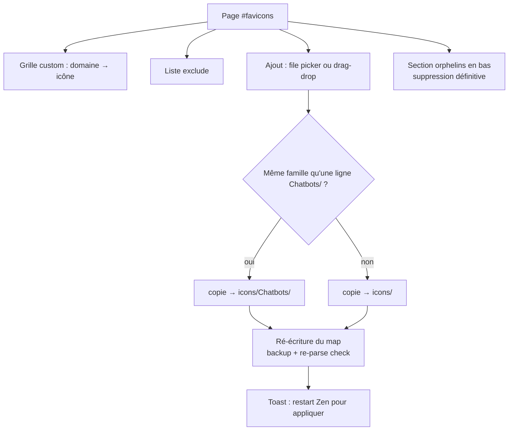

# MyHub — Page Favicons · SPEC

> Mini-spec dédiée à la première page custom (V2.1 n°1).
> Source de vérité pour l'implémentation — figée le 2026-08-19 après brainstorm.

## Pourquoi cette page existe

Le workflow actuel d'ajout d'une icône CustomFavicon est un flux manuel à 2 étapes :

1. Copier le PNG dans le bon dossier (`icons/` ou `icons/Chatbots/`)
2. Éditer `favicon-map.json` à la main (clé domaine → chemin relatif)

C'est la friction n°1 de l'écosystème (dernier exemple : `watchar.png` / `localhost`).
Cette page transforme les 2 étapes en 2 clics, **sans changer le format des données**
— `favicon-map.json` et les dossiers restent identiques, les mods consommateurs
(CustomFavicon, URLBar-2.0, MyHub favoris) ne changent d'aucun byte.

## Vue d'ensemble

## UX

### Grilles `custom` — deux sections : « Chatbots » et « Sites »

- Pattern `.mh-tile` de la page Firefox : icône + domaine en label
- **Séparation visuelle = rangement disque** : les lignes dont le chemin commence
  par `Chatbots/` s'affichent dans la section Chatbots, les autres dans Sites.
  La section EST le tiroir — aucun badge nécessaire
- Hover → actions : **✎ remplacer l'icône** (file picker), **✕ retirer la ligne**
  (le PNG devient orphelin → il migre vers la section orphelins, jamais supprimé ici)
- Tuile « + Ajouter » par section : prompt domaine + file picker PNG
  (l'ajout dans la section Chatbots range le PNG dans `Chatbots/`, dans Sites → racine)
- **Drag d'une tuile vers l'autre section = déplacement** : move du PNG
  (racine ⇄ `Chatbots/`) + réécriture du chemin dans le map

### Entrées d'icône (A+C)

| Canal | Mécanique |
|---|---|
| File picker | `nsIFilePicker` → `IOUtils.copy` vers le canon |
| Drag-drop | `drop` sur la tuile + `DataTransfer.files[0]` → même copie |

Même code de copie, deux canaux. Formats acceptés : `.png` (contrôlé à l'entrée).

### Liste `exclude`

- Une ligne par domaine exclu, toggle on/off
- Ajout/suppression comme la grille, sans icône

### Section orphelins (bas de page)

- Énumération `IOUtils.getChildren(icons/)` + `icons/Chatbots/` au chargement de la
  page uniquement (zéro polling)
- PNG présents sur disque mais référencés par aucune ligne → mini-tuiles
- **Suppression définitive** (`IOUtils.remove`) — un par un, geste explicite.
  Jamais automatique : les `_white` et autres backups sont en sécurité

## Mécanique

### Rangement des nouveaux PNG — dérivé de la section d'ajout

Le sélecteur de tiroir n'existe pas : **la section dans laquelle tu ajoutes détermine
le dossier** (`Chatbots/` ou racine). Pour le drag inter-sections, c'est le move
décrit ci-dessus. Zéro décision utilisateur ailleurs que le choix de la section.

### Écriture sécurisée (pattern favoris)

1. Sérialiser la nouvelle version du map
2. **Re-parser** le JSON sérialisé — si ça ne re-parse pas, refus d'écrire
3. Backup `favicon-map.json.provisional-backup` (écrase le précédent)
4. `IOUtils.writeUTF8`
5. Toast « Restart Zen pour appliquer »

### Application des changements

**Restart classique.** Les consommateurs chargent le map au démarrage — la page ne
fait qu'écrire le fichier. Le reload à chaud (`Services.obs`) est une mission
dédiée V2.2 (cf. leçon favoris urlbar : recherche en amont obligatoire avant de
toucher aux caches).

## Non-goals

- ❌ Reload à chaud des mods consommateurs (V2.2)
- ❌ Fetch d'icône par URL (option B — non retenue)
- ❌ Garbage-collect automatique des orphelins (toujours manuel)
- ❌ git/push depuis la page — le hub touche aux fichiers du profil, jamais au repo

## Perf

- Page chargée à la demande (`manager.html`), rien en mémoire hors MyHub
- Énumération des dossiers au boot de la page seulement
- Copie de fichiers ponctuelle (quelques Ko), tout event-driven

## Plan de validation

1. Boot de la page : grille fidèle au map (35 domaines), excludes listés
2. Ajout : picker + drag-drop → PNG au bon endroit, ligne ajoutée, map ré-écrit
3. Remplacement : drag un PNG sur une tuile existante → icône changée
4. Retrait de ligne : ligne disparaît, PNG migre en orphelins
5. Orphelins : suppression définitive vérifiée sur disque
6. Corrompre volontairement le map (test) → refus d'écriture, backup intact
7. Restart Zen → icône visible onglet/urlbar/favoris
